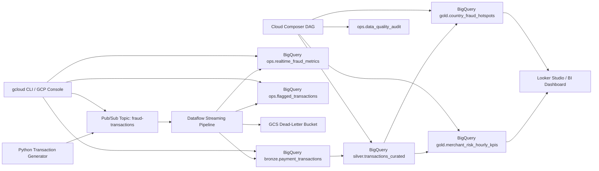

# FraudShield: Real-Time Payment Fraud Detection Platform on GCP

FraudShield is an interview-focused, end-to-end GCP Data Engineering project that simulates card payment transactions, processes them in real time, scores fraud risk with streaming rules, stores curated outputs in BigQuery, and orchestrates downstream reporting with Cloud Composer.

## Why this project stands out

- It solves a business problem that interviewers immediately understand: detecting suspicious transactions quickly enough to reduce fraud loss.
- It demonstrates real-time data engineering using `Pub/Sub`, `Dataflow`, `BigQuery`, `Cloud Storage`, and `Cloud Composer`.
- It gives you strong discussion points around schema validation, dead-letter handling, streaming deduplication, fraud rules, alerting, data quality, and cost optimization.
- It lets you quantify impact in business language such as fraud exposure, alert volume, approval rate, and suspicious transaction share.

## Business scenario

A digital payments company wants a streaming platform that can:

- ingest payment authorization events in near real time,
- identify suspicious transactions using rule-based scoring,
- store flagged transactions for fraud operations review,
- maintain analytics-ready fraud KPI tables for merchants and countries,
- preserve invalid records for replay and troubleshooting.

## End-to-end architecture



## Project structure

```text
fraudshield/
|-- README.md
|-- config/
|   `-- pipeline_config.example.json
|-- docs/
|   |-- architecture.md
|   |-- interview-guide.md
|   |-- manual-gcp-setup.md
|   `-- resume-kit.md
|-- orchestration/
|   `-- composer/
|       `-- fraudshield_realtime_dag.py
|-- scripts/
|   `-- gcloud/
|       `-- setup_fraudshield.ps1
|-- sql/
|   |-- 01_create_objects.sql
|   |-- 02_silver_transactions_curated.sql
|   |-- 03_gold_risk_kpis.sql
|   `-- 04_data_quality_checks.sql
|-- src/
|   |-- __init__.py
|   |-- producer/
|   |   `-- transaction_events_producer.py
|   `-- streaming/
|       |-- __init__.py
|       |-- pipeline.py
|       |-- schemas.py
|       `-- transforms.py
|-- tests/
|   `-- test_transforms.py
`-- requirements.txt
```

## Core datasets and tables

- `bronze.payment_transactions`
  Validated event-level transaction stream
- `ops.flagged_transactions`
  High-risk transactions emitted directly from the streaming pipeline
- `ops.realtime_fraud_metrics`
  One-minute fraud metrics for dashboards and operations
- `silver.transactions_curated`
  Curated transaction-level table with fraud risk breakdown
- `gold.merchant_risk_hourly_kpis`
  Merchant and category fraud KPIs
- `gold.country_fraud_hotspots`
  Country-level fraud concentration and decline trends
- `ops.data_quality_audit`
  Data quality audit log for warehouse checks

## Real-time fraud rules

FraudShield assigns a streaming `risk_score` and `risk_level` to each transaction using event attributes such as:

- high transaction amount,
- cross-border usage,
- card-not-present transactions,
- new device usage,
- risky merchant categories,
- rapid declines or suspicious approval patterns.

This is intentionally rule-based so you can explain it clearly in interviews. You can later mention ML scoring as a production enhancement.

## How to run

### 1. Provision core resources

Option A: automated setup via PowerShell and `gcloud`

```powershell
powershell -ExecutionPolicy Bypass -File .\fraudshield\scripts\gcloud\setup_fraudshield.ps1 `
  -ProjectId your-gcp-project-id `
  -Region us-central1 `
  -DatasetLocation US
```

Option B: follow [manual-gcp-setup.md](/C:/Users/Srinivas%20Porandla/OneDrive/Documents/New%20project/fraudshield/docs/manual-gcp-setup.md)

### 2. Create the base BigQuery objects

Run [01_create_objects.sql](/C:/Users/Srinivas%20Porandla/OneDrive/Documents/New%20project/fraudshield/sql/01_create_objects.sql) after replacing the project ID placeholder.

### 3. Install dependencies

```powershell
python -m venv .venv
.venv\Scripts\activate
pip install -r .\fraudshield\requirements.txt
```

### 4. Start the streaming pipeline

```powershell
python -m fraudshield.src.streaming.pipeline `
  --project_id=your-gcp-project-id `
  --region=us-central1 `
  --input_subscription=projects/your-gcp-project-id/subscriptions/fraud-transactions-sub `
  --raw_table=your-gcp-project-id:bronze.payment_transactions `
  --alerts_table=your-gcp-project-id:ops.flagged_transactions `
  --metrics_table=your-gcp-project-id:ops.realtime_fraud_metrics `
  --dead_letter_path=gs://your-gcp-project-id-fraudshield-raw/dead-letter/fraud-transactions `
  --temp_location=gs://your-gcp-project-id-fraudshield-temp/dataflow/temp `
  --staging_location=gs://your-gcp-project-id-fraudshield-temp/dataflow/staging `
  --runner=DataflowRunner
```

### 5. Publish sample transactions

```powershell
python -m fraudshield.src.producer.transaction_events_producer `
  --project_id=your-gcp-project-id `
  --topic_id=fraud-transactions `
  --event_count=500 `
  --sleep_seconds=0.3
```

### 6. Build silver, gold, and quality checks

Run the SQL files in order or deploy the Composer DAG from [fraudshield_realtime_dag.py](/C:/Users/Srinivas%20Porandla/OneDrive/Documents/New%20project/fraudshield/orchestration/composer/fraudshield_realtime_dag.py).

## Interview story

Tell the project in this sequence:

1. Payment events enter through Pub/Sub in near real time.
2. Dataflow validates, normalizes, deduplicates, and risk-scores transactions.
3. High-risk events are written to an alerts table for fraud operations.
4. Curated BigQuery models support merchant and geography-level fraud analytics.
5. Composer schedules downstream KPI and data quality jobs.
6. `gcloud` setup and manual documentation make the project easy to reproduce.

## Resume and interview assets

- Resume bullets: [resume-kit.md](/C:/Users/Srinivas%20Porandla/OneDrive/Documents/New%20project/fraudshield/docs/resume-kit.md)
- Architecture deep dive: [architecture.md](/C:/Users/Srinivas%20Porandla/OneDrive/Documents/New%20project/fraudshield/docs/architecture.md)
- Mock interview Q&A: [interview-guide.md](/C:/Users/Srinivas%20Porandla/OneDrive/Documents/New%20project/fraudshield/docs/interview-guide.md)

