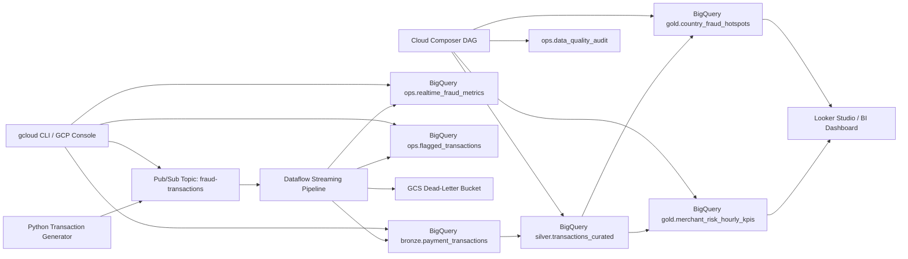

# FraudShield: Real-Time Payment Fraud Detection Platform on GCP

Portfolio project for `GCP Data Engineering`, `stream processing`, and `fraud analytics`.

FraudShield is an end-to-end real-time data platform that simulates payment authorization events, processes them through `Pub/Sub` and `Dataflow`, applies rule-based fraud scoring, writes flagged transactions and metrics to `BigQuery`, and orchestrates downstream analytical tables with `Cloud Composer`.

## Why This Repo Is Worth Reviewing

- Solves a business problem that is easy for interviewers and recruiters to understand.
- Demonstrates real-time streaming, operational alerting, and analytical warehousing in one project.
- Shows production-style patterns such as validation, dead-letter handling, deduplication, partitioning, clustering, and scheduled data quality checks.
- Gives strong talking points around fraud scoring, merchant risk analysis, and country-level fraud hotspots.

## Project Snapshot

Business problem:
A payments company needs to identify suspicious transactions quickly enough for operational review and risk monitoring.

What the pipeline does:

- ingests payment events through `Pub/Sub`
- validates and normalizes transactions in `Dataflow`
- deduplicates records by `transaction_id`
- assigns a rule-based `risk_score`, `risk_level`, and `risk_reasons`
- writes high-risk transactions to an alerts table
- builds `bronze`, `silver`, and `gold` fraud analytics tables in `BigQuery`
- runs downstream KPI and DQ jobs with `Cloud Composer`

## Architecture



## Tech Stack

- `GCP`: Pub/Sub, Dataflow, BigQuery, Cloud Storage, Cloud Composer
- `Languages`: Python, SQL, PowerShell
- `Frameworks and Tools`: Apache Beam, Airflow, `gcloud` CLI
- `Patterns`: streaming ETL, rule-based fraud scoring, operational alerting, bronze/silver/gold modeling

## What This Project Demonstrates

- Real-time fraud-oriented stream processing on GCP
- Rule-based risk scoring with explainable outcomes
- Direct operational outputs for flagged transactions
- One-minute fraud metrics for dashboards
- Curated analytical models for merchant and geography-level reporting
- Data quality auditing and replayable bad-record handling

## Fraud Rules Used In Streaming

- high-value transaction amount
- cross-border usage
- card-not-present activity
- new device indicator
- risky merchant category
- declined transaction behavior

These signals drive:

- `risk_score`
- `risk_level`
- `risk_reasons`

## Data Model

| Layer | Table | Purpose |
|---|---|---|
| `bronze` | `payment_transactions` | validated transaction stream |
| `ops` | `flagged_transactions` | high-risk transactions for review |
| `ops` | `realtime_fraud_metrics` | one-minute fraud operations metrics |
| `silver` | `transactions_curated` | curated transaction-level risk dataset |
| `gold` | `merchant_risk_hourly_kpis` | merchant/category fraud KPIs |
| `gold` | `country_fraud_hotspots` | country-level fraud concentration analysis |
| `ops` | `data_quality_audit` | warehouse quality check results |

## Business Metrics

- suspicious transaction count
- high-risk transaction share
- approved amount
- decline rate
- merchant-level fraud concentration
- country fraud hotspots
- average risk score

## Quick Start

### 1. Provision core resources

Option A: automated setup

```powershell
powershell -ExecutionPolicy Bypass -File .\scripts\gcloud\setup_fraudshield.ps1 `
  -ProjectId your-gcp-project-id `
  -Region us-central1 `
  -DatasetLocation US
```

Option B: manual setup

- Follow [docs/manual-gcp-setup.md](docs/manual-gcp-setup.md)

### 2. Create base tables

- Run [sql/01_create_objects.sql](sql/01_create_objects.sql) after replacing `your-gcp-project-id`

### 3. Install dependencies

```powershell
python -m venv .venv
.venv\Scripts\activate
pip install -r requirements.txt
```

### 4. Run the streaming pipeline

```powershell
python -m src.streaming.pipeline `
  --project_id=your-gcp-project-id `
  --region=us-central1 `
  --input_subscription=projects/your-gcp-project-id/subscriptions/fraud-transactions-sub `
  --raw_table=your-gcp-project-id:bronze.payment_transactions `
  --alerts_table=your-gcp-project-id:ops.flagged_transactions `
  --metrics_table=your-gcp-project-id:ops.realtime_fraud_metrics `
  --dead_letter_path=gs://your-gcp-project-id-fraudshield-raw/dead-letter/fraud-transactions `
  --temp_location=gs://your-gcp-project-id-fraudshield-temp/dataflow/temp `
  --staging_location=gs://your-gcp-project-id-fraudshield-temp/dataflow/staging `
  --runner=DataflowRunner
```

### 5. Publish sample transactions

```powershell
python -m src.producer.transaction_events_producer `
  --project_id=your-gcp-project-id `
  --topic_id=fraud-transactions `
  --event_count=500 `
  --sleep_seconds=0.3
```

### 6. Build curated layers

- Run [sql/02_silver_transactions_curated.sql](sql/02_silver_transactions_curated.sql)
- Run [sql/03_gold_risk_kpis.sql](sql/03_gold_risk_kpis.sql)
- Run [sql/04_data_quality_checks.sql](sql/04_data_quality_checks.sql)
- Or deploy [orchestration/composer/fraudshield_realtime_dag.py](orchestration/composer/fraudshield_realtime_dag.py)

## Key Files

- Streaming pipeline: [src/streaming/pipeline.py](src/streaming/pipeline.py)
- Fraud logic: [src/streaming/transforms.py](src/streaming/transforms.py)
- Event producer: [src/producer/transaction_events_producer.py](src/producer/transaction_events_producer.py)
- Composer DAG: [orchestration/composer/fraudshield_realtime_dag.py](orchestration/composer/fraudshield_realtime_dag.py)
- Architecture notes: [docs/architecture.md](docs/architecture.md)
- Interview prep: [docs/interview-guide.md](docs/interview-guide.md)
- Resume bullets: [docs/resume-kit.md](docs/resume-kit.md)

## Interview Talking Points

- Why fraud detection is a strong real-time use case
- Why `Dataflow` is a better fit than `Dataproc` here
- How the pipeline separates operational alerts from analytical reporting
- How rule-based scoring remains explainable and interview-friendly
- What the next production step would be, such as velocity features or ML scoring

## Resume-Ready Summary

Built a real-time fraud detection platform on `GCP` using `Pub/Sub`, `Dataflow`, `BigQuery`, `Cloud Composer`, and `Cloud Storage` to process payment transactions, assign rule-based fraud scores, generate flagged transaction alerts, and deliver merchant and country-level fraud analytics.
